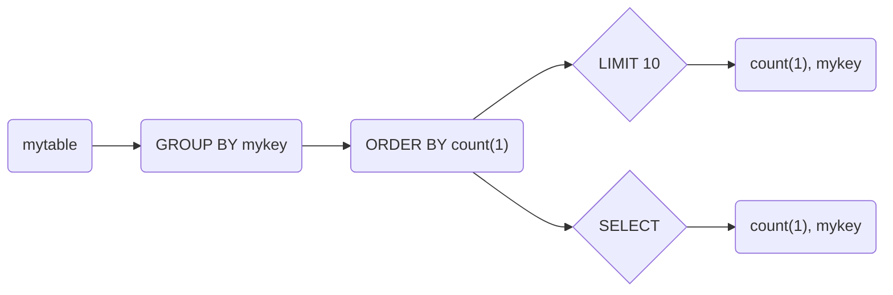
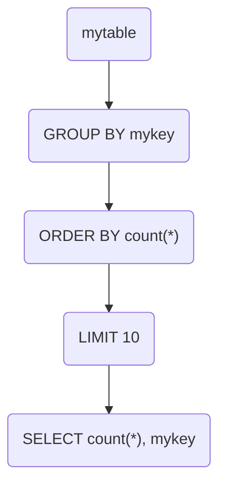

# ChatGPT Generated Diagrams

1. Generate the mermaid.js markdown compatible with Github represent this SQL Query: 

`SELECT count(*), mykey from mytable GROUP BY mykey ORDER BY count(*) DESC LIMIT 10`

2. One possible way to generate the mermaid.js markdown compatible with Github to represent the logical execution plan for this SQL query is:

