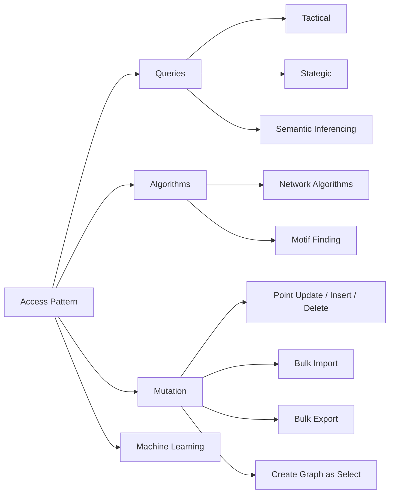

```mermaid
flowchart LR;
n1[Access Pattern] --> n2[Queries] --> n3[Tactical]
n2 --> n4[Stategic]
n2 --> n5[Semantic Inferencing]
n1 --> n6[Algorithms]
n6 --> n7[Network Algorithms]
n6 --> n8[Motif Finding]
n1 --> n9[Mutation]
n1 --> n20[Machine Learning]
n9 --> n30[Point Update / Insert / Delete]
n9 --> n32[Bulk Import]
n9 --> n33[Bulk Export]
n9 --> n34[Create Graph as Select]

```
