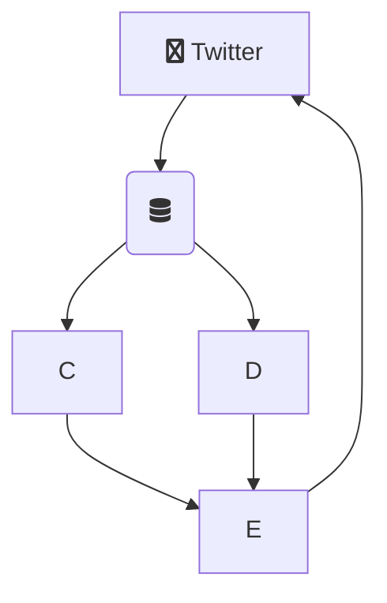
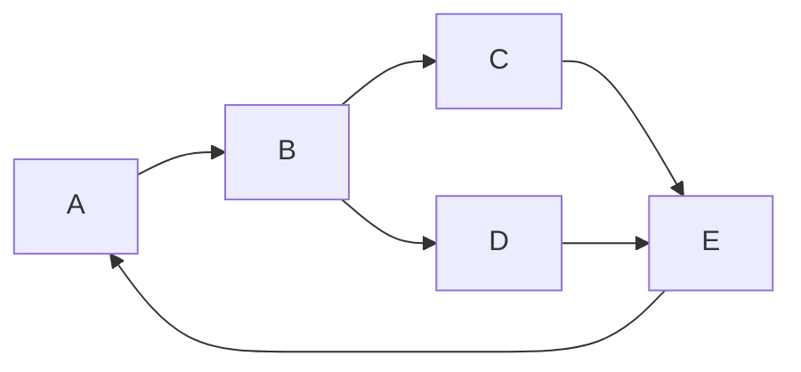
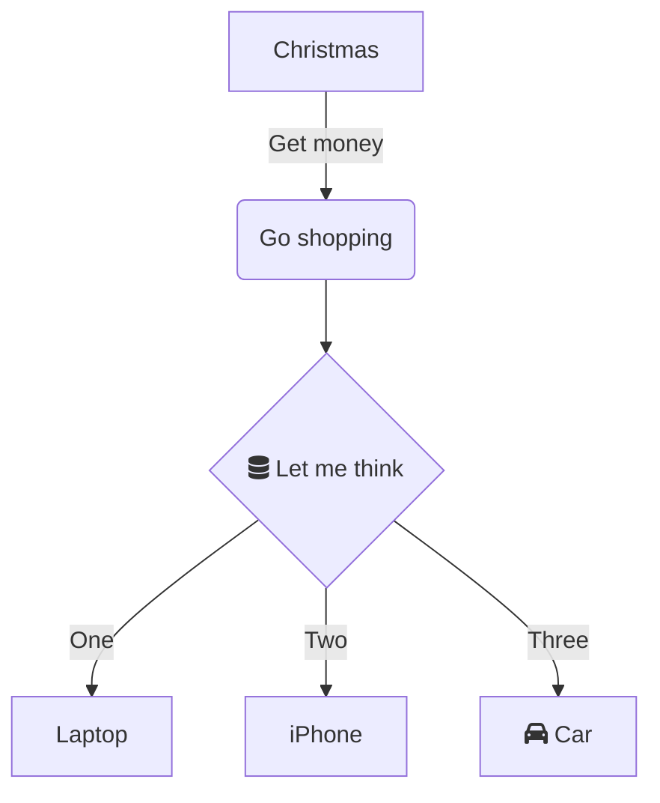
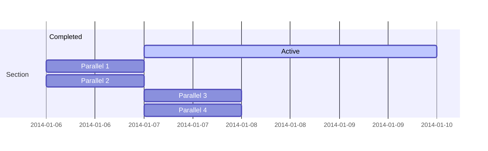

# Mermaid visuals

See [mermaid-js](https://mermaid-js.github.io/mermaid/#/)
Mermaid lets you create diagrams and visualizations using text and code.

It is a Javascript based diagramming and charting tool that renders Markdown-inspired text definitions to create and modify diagrams dynamically.

If you are familiar with Markdown you should have no problem learning Mermaid's Syntax.

 

